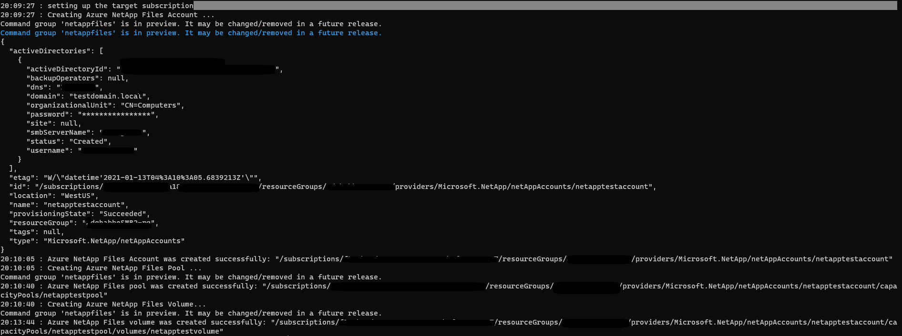

# Azure CLI NetAppFiles module SMB Sample

This project demonstrates how to deploy SMB protocol type volume using Azure CLI NetAppFiles module.

In this sample application we perform the following operations:

* Creation
  * NetApp account
  *	Capacity pool 
  * SMB volume 
 
* Deletion   
	The clean-up process takes place, deleting all resources in the reverse order following the hierarchy.  Otherwise, we can't remove resources that have nested resources still live. (The clean-up process is not enabled by default. You need to set the parameter SHOULD_CLEANUP to true if you want the clean-up code to take a place)

If you don't already have a Microsoft Azure subscription, you can get a FREE trial account [here](http://go.microsoft.com/fwlink/?LinkId=330212).

## Prerequisites

1. Azure subscription
1. Subscription needs to be enabled for Azure NetApp Files. For more information, please refer to [this](https://docs.microsoft.com/azure/azure-netapp-files/azure-netapp-files-register#waitlist) document.
1. Resource Group created
1. Virtual Network with a delegated subnet to Microsoft.Netapp/volumes resource. For more information, please refer to [Guidelines for Azure NetApp Files network planning](https://docs.microsoft.com/en-us/azure/azure-netapp-files/azure-netapp-files-network-topologies)
1. Make sure [Azure CLI](https://docs.microsoft.com/cli/azure/install-azure-cli) is installed.
1. Windows with WSL enabled (Windows Subsystem for Linux) or Linux to run the script. This was developed/tested on Ubuntu 18.04 LTS (bash version 4.4.20).
1. Make sure [jq](https://stedolan.github.io/jq/) package is installed before executing this script.
	
	
# How the project is structured

The following table describes all files within this solution:

| Folder     | FileName                | Description                                                                                                                         |
|------------|-------------------------|-------------------------------------------------------------------------------------------------------------------------------------|
| src        | CreateANFVolume.sh      | Authenticates and executes all operations                                                                                           |

# How to run the CLI script

1. Clone the script locally: 
    ```powershell
    git clone https://github.com/Azure-Samples/netappfiles-cli-smb-sample.git
    ```
	
1. Open a bash session and execute the following Run the script: 

	 * Change folder to **netappfiles-cli-smb-sample\src\**
	 * Open CreateANFVolume.sh and edit all the parameters
	 * Save and close
	 * Run the following command
	 ``` Terminal
	 ./CreateANFVolume.sh
	 ```

	Sample output
	

	
# References

* [Azure NetApp Files Az commands](https://docs.microsoft.com/en-us/cli/azure/netappfiles?view=azure-cli-latest)
* [Resource limits for Azure NetApp Files](https://docs.microsoft.com/en-us/azure/azure-netapp-files/azure-netapp-files-resource-limits)
* [Azure Cloud Shell](https://docs.microsoft.com/en-us/azure/cloud-shell/quickstart)
* [Download Azure SDKs](https://azure.microsoft.com/downloads/)
* [Azure CLI docker](https://docs.microsoft.com/en-us/cli/azure/run-azure-cli-docker)
